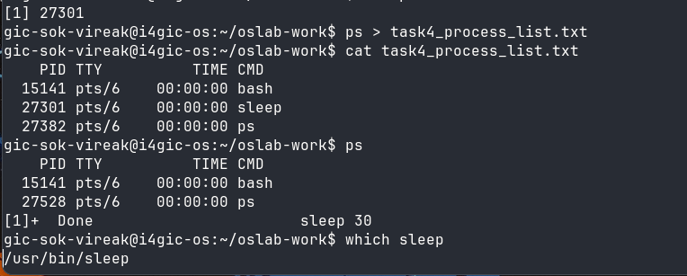
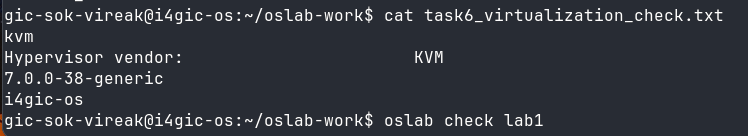

# OS Lab 1 Submission

- **Student Name:** Sok Vireak
- **Student ID:** e20231270
- **Ubuntu username on the server:** gic-sok-vireak
- **My values** (`oslab values lab1`): file1 = forest, file2 = cloud, count = 2

---

## Task 1: Operating System Identification

I observed that the server is running Ubuntu 26.04.1 LTS on Linux. The kernel version is `7.0.0-38-generic`, and the distribution version is `Ubuntu 26.04.1 LTS`.

---

## Task 2: Essential Linux File and Directory Commands

I created the files `forest.txt` and `cloud.txt`, copied `forest.txt`, renamed `cloud.txt` to `cloud_renamed.txt`, and removed the copy. The last `ls` showed `cloud_renamed.txt` and `forest.txt`.

---

## Task 3: Package Management Using APT

I observed that `apt remove` removed the package but left its configuration folder in `/etc`. After `apt purge`, the `/etc/mc` folder was deleted, and `ls -ld /etc/mc` showed that it no longer existed.

<!-- SCREENSHOT REQUIREMENT: your terminal after the purge, showing `ls -ld /etc/mc` and your prompt. -->

---

## Task 4: Programs vs Processes

I used `which sleep` to see that the `sleep` program file is stored at `/usr/bin/sleep`. Then I ran `sleep 30 &` to start it in the background and used `ps` to see the running `sleep` process. A program is a file on disk that can be run, while a process is a running instance of a program. Before starting it there was no `sleep` process, during the command `ps` showed `sleep`, and after it finished the process disappeared while the program file still remained on disk.

---

## Task 5: Multitasking

I started two copies of `sleep` in the background and then ran `ps`. The output showed 2 lines with `sleep`. This shows that the operating system can manage multiple processes at the same time. It does not prove that the CPU is running both processes at the exact same instant, because the operating system may switch CPU time between them.

<!-- SCREENSHOT REQUIREMENT: your terminal with the `ps` result and your prompt. -->

---

## Task 6: Virtualization and Hypervisor Detection

The system is running on a virtual machine. The output showed `kvm` and `Hypervisor vendor: KVM`, so the machine is virtualized using KVM.

<!-- SCREENSHOT REQUIREMENT: your terminal with the output of the four commands and your prompt. -->

---

## My Prediction: Confirmed or Corrected

- Prediction 1: I predicted that starting 2 copies of `sleep` would show 2 `sleep` lines in `ps`. This was confirmed, because `ps` showed 2 `sleep` lines.
- Prediction 2: I predicted that after the copies finished, the `sleep` program file would still be on disk. This was confirmed, because `which sleep` still showed `/usr/bin/sleep`.
- Prediction 3: I predicted that `apt-get remove` would delete the package configuration folder in `/etc`. This was corrected, because `remove` left `/etc/mc`, but `purge` deleted it.
- Prediction 4: I predicted that a program is static code stored on disk, while a process is that program actively running in memory. This was confirmed by the `sleep` experiment: `/usr/bin/sleep` stayed on disk, while the running `sleep` process appeared in `ps` only while it was active.

---

## Plus / Challenge (only if you did them)

I did not do the plus/challenge tasks.

## AI Note (optional)

An AI tool suggested that `apt remove` can leave configuration files while `apt purge` removes them. I checked this by running the commands and using `ls -ld /etc/mc` to see that the folder existed after remove but did not exist after purge.
